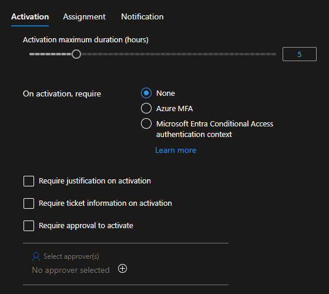
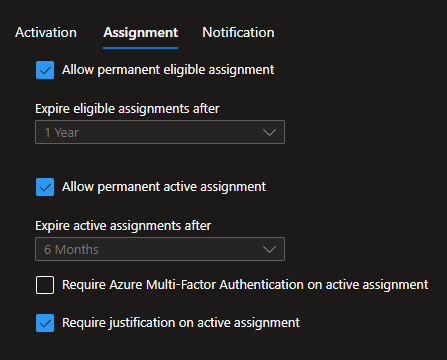
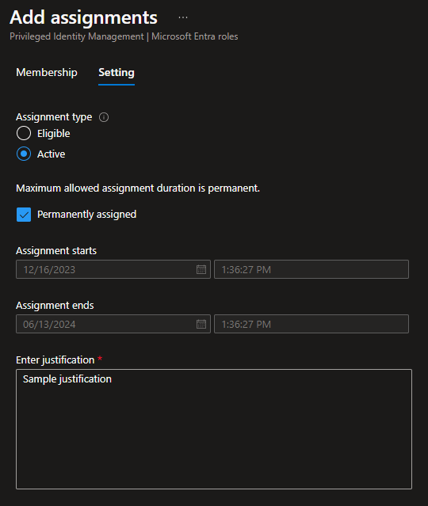
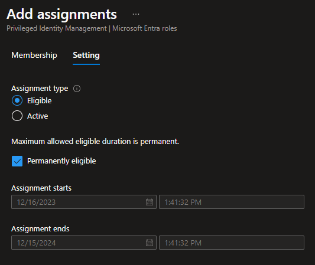

# Azure PIM Security

Azure Privileged Identity Management (PIM) security scenarios.

To create the sample resources:

```sh
cp config/template.tfvars .auto.tfvars

terraform init
terraform apply -auto-approve
```

### Role settings

Settings you can require on `activation`:

- MFA, or conditional access authentication context
- Justification
- Ticket information
- Approval

Assignment:

- Allow permanent eligible assignment (or set to expire)
- Allow permanent active assignment (or set ot expire)
- Require Azure MFA on active assignment
- Require justification on active assignment

### Scenario

Here is a scenario for PIM assignment.

The following users will be created:

| Name     | Member of      |
|----------|----------------|
| User1    | Group1         |
| User2    | Group2         |
| User3    | Group1, Group2 |

> ℹ️ `Group1` and `Group2` are already created with PIM roles assignment enabled

To execute this PIM scenario, configure a role such as `Security Administrator` like this:





`Group1` assignment:



`Group2` assignment:


